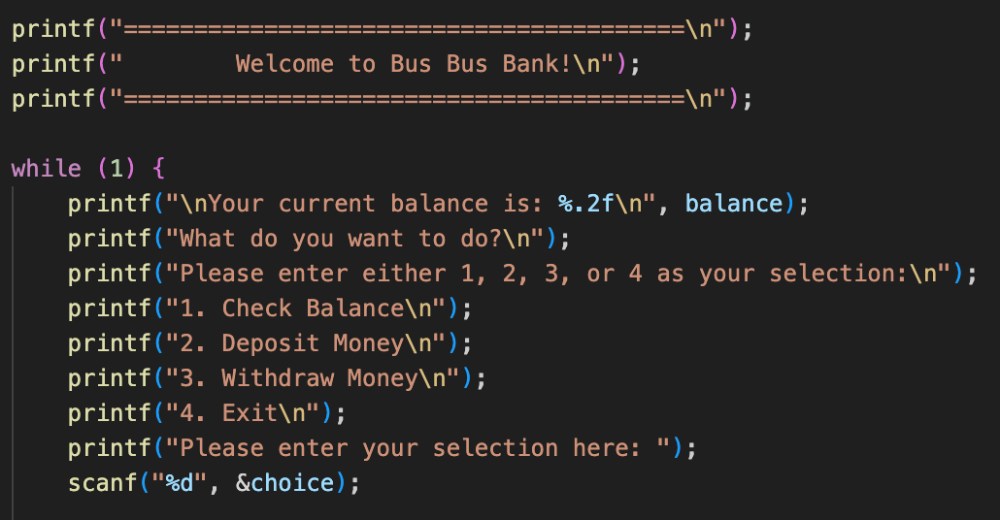
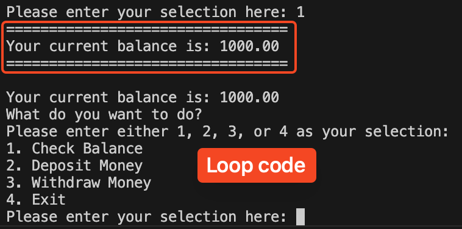
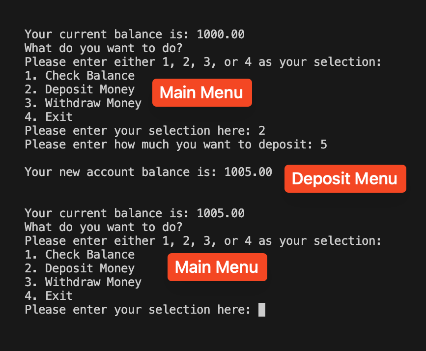
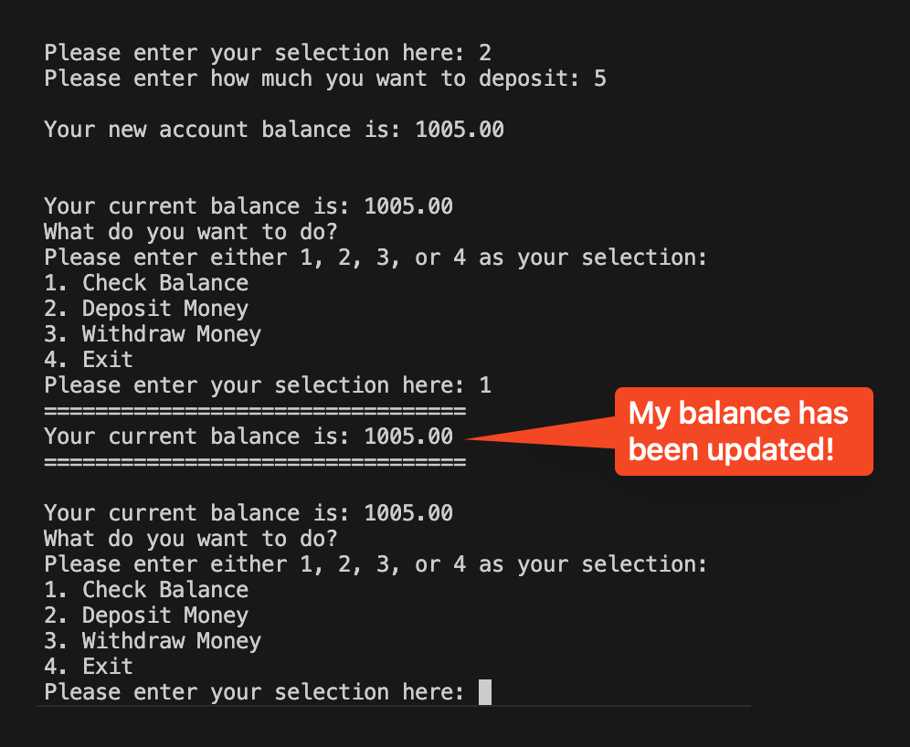
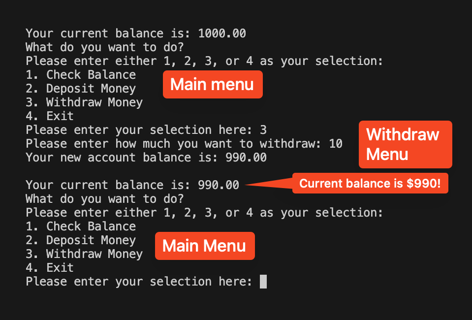
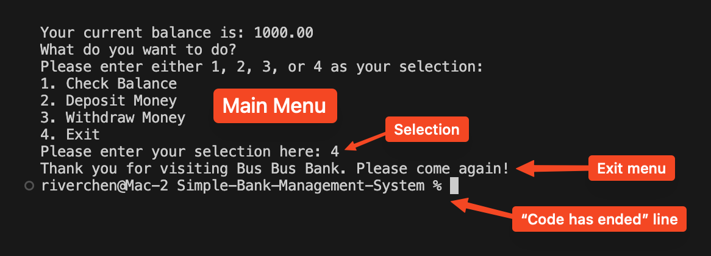
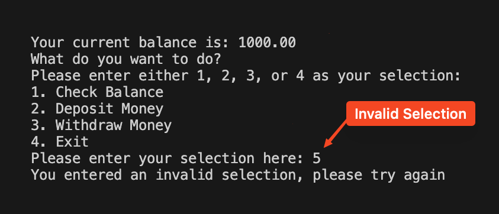
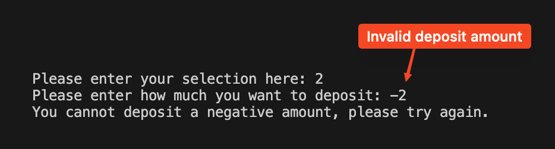
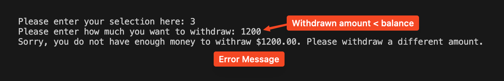
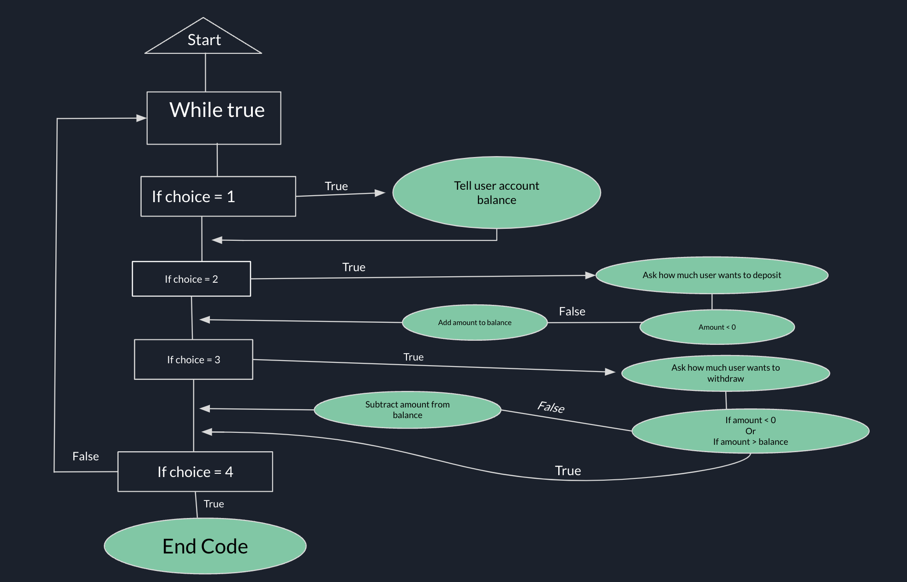

# Simple-Bank-Management-System

# 1. Description
This is a simple banking system that runs on C coding language. It can perform simple tasks such as check balance, deposit money, withdraw money, and exit system. **The user's balance is automatically set to 1000 USD as a welcome bonus.**

## 1.1. What I Learned
From this project, I learned all the basics of coding in C programming language. The things I learned are:

- **Data types:** I learned the different data types such as int, float, and char and the different characters that they can hold.

- **Scanf():** I learned how to read user input and have the code do functions based on the user input.

- **While loop:** I learned how to loop the code each time after the user did a selection. This was done with the (while) function.

- **Design:** I learned how to make a user-friendly design in the terminal by using methods such as the new line function and === to make a welcome menu

- **If function (conditional statements):** I learned how to use the if function with scanf() by using it to determine what to do based on user input. 

- **Buffer Clean:** I learned how to clean the buffer after each scanf() input to avoid the code from printing garbage data stored in the buffer. 

- **Printf():** I learned how to use printf() to make print out different lines of text in the terminal to make the user experience more enjoyable.

- The user's balance is set to 1000 USD as a welcome bonus

- A user-friendly emnu with 4 different selections:
  - 1. Check current balance
  - 2. Deposit money
  - 3. Withdraw money
  - 4. Exit bank

- Detect user input errors such as:
  - Negative numbers for depositing and withdrawing money
  - User's current balance is not enough to withdraw requested amount

- Simple implementation
- Ensures that user will deposit and withdraw valid amounts of money

# 2. Features
- Users balance set to 1000 USD by default as a welcome balance
- There is a user friendly menu with 4 basic bank operations: 
  - Check balance
  - Deposit money
  - Withdraw money
  - Exit system
- Error detection for user input errors:
  - Detect if user input for deposit and withdraw money is negative or positive
  - Detection for checking is withdrawal input is less than current balance
  - Detection for invalid selections
- Efficient implementation in C language

# 3. Using the Banking System

When you first run the program, a welcome/main menu will show up, which will prompt the user to make a selection. This menu looks like this: 

The user can enter a number as their selection. The number will map to a function. 

### 3.1. Checking the balance
If the user wants to check their current balance, they can select 1, which will map to check their balance. This is what the menu for checking the balance looks like:

You can see that in the code, I selected 1. After selecting 1, the code will show that my current balance is 1000 dollars. After the code displays my current balance, it will loop back to show the main menu. 

### 3.2. Depositing Money
If the user wants to deposit some money into their account, the selection to do that is 2. This is what the deposit money menu looks like. 

In this screenshot, you can see that when I select 2, the code will ask me how much I want to deposit. I wanted to deposit 5 dollars. Then, the program will add 5 dollars to my account, and then update my current balance.

*__*If I want to check my balance to make sure that I got the extra 5 dollars, I can check by selecting 1 at the main menu again:*__*

### 3.3. Withdrawing Money
If the user wants to withdraw money out of their account, they can do so by selecting 3, which will map to withdrawing money. This is what the withdrawing money menu will look like: 

*__*The code was reset so the current balance is $1000 instead of $1005.*__*

As you can see here, I selected 3 to withdraw money, and then entered 10 as the amount that I wanted to withdraw. After, it updated my balance to $990, which is confirmed when the main menu is shown again. 

## 3.4. Exiting the System

If the user wants to exit the system, they can do so by selecting 4, which maps to exit system. This is the exit system menu:

As you can see here, I entered 4 to exit the system. After I pressed enter, the code displays a goodbye message and then ends. You can see where the code ended by looking at the last line in the screenshot. 

## 3.5. Error Detection

This program must have error detection to ensure that the user makes valid transactions. These are the different erros that the bank system can detect. 
- Invalid user selection
- Invalid withdrawal amounts (Amount < Balance, Negative Numbers)
- Invalid depost amounts(Negative Numbers)
   
### This is example of error detection: 

Example 1: Invalid Selection

You can see that when I enter 5 as my selection, it shows up as invalid becuase 4 is not a selection on the main menu. 

Example 2: Depositing money error: 

You can see here that I entered a negative number as my selection. The code recognizes that the number is negative and displays an error message in response to it. 

Example 3: Withdrawing money error: 

Here, I attemped to withdraw 1200 dollars out of my account when I only have 1000 dollars. The program recognizes that I don't have enough money to withdraw the requested amount, so it will display an error message. 

# 4. Implementation
This part will show the implementation that was used in this program and display the logic and structure of all the code in a simple way.

## 4.1. Float Chart Diagram
This is a simple float chart diagram which shows the entire logic of the code in a simple way. This was made by me. 

## 4.2 Important Implementation Details

These are some of the most important implementation used in this code: 

- **Looping:** Looping the code is very important, because this allows the code to keep running after each user selection. In this simple bank system, the code will loop to the main menu after the user finishes making their selection. 

- **User input collection:** This uses scanf() to read input from the user, and the scanf() will be used with if loop. In the future, buffer cleaning with getchar() could be used to prevent the code from printing garbage data. 

- **Error detection:** Error detection in the code will ensure that the user inputs are all valid. This includes selections withing 1-4, deposit money and withdraw money inputs are not negative numbers, and when withdrawing money, the user's requested withdrawal amount is not more than their current balance.

- **Exiting the bank:** When the user enters 4 as their selection, the code will display a goodbye message, and then terminate by using return 0;.
  

  
